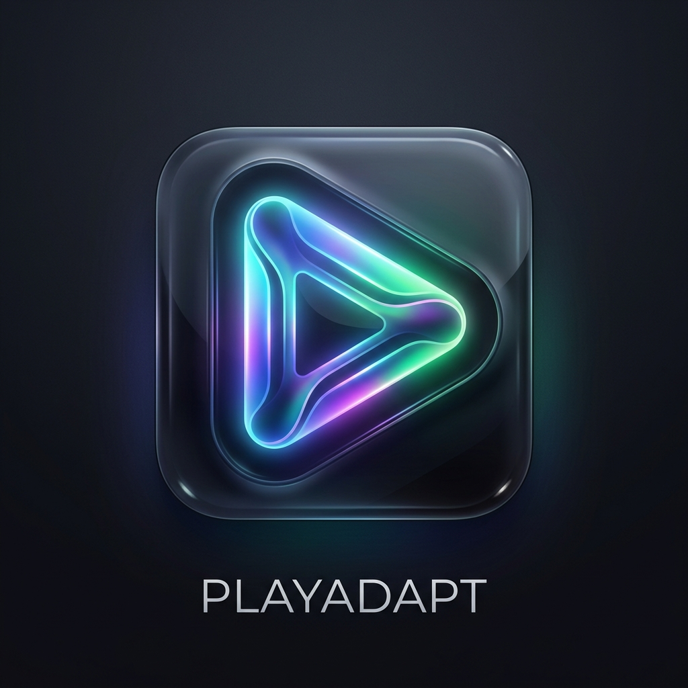

<p align="center">
  
</p>

<h1 align="center">PlayAdapt - Theme-Adaptive Jellyfin Player Engine</h1>

[](LICENSE)
[](https://jellyfin.org/)

**PlayAdapt** is a native, zero-residue player enhancement and feature injection engine for the official [Jellyfin](https://jellyfin.org/) web client.

It solves the fundamental problem of client modifications breaking across custom CSS and themes: instead of hardcoding element selectors or fixed styling, PlayAdapt dynamically **inspects the active theme** (Abyss, UltraChromic, JellyFlix, Stock, or custom user styles) and **synthesizes native style tokens, geometry, and glassmorphic blurs** in real-time. It places new features where one would expect given how each specific theme arranges controls, and allows completely new UI constructs to look like they were designed for that theme from day one.

---

## 💡 Architecture & Philosophy

Following the same architectural principles as [Physeerlia](https://github.com/hermes-pantheon-pb/Physeerlia---Seer-Jellyfin-Plugin):
> *"Look as seamlessly integrated as possible while remaining as isolated as possible... avoiding touching the database or filesystem, it is designed to survive server updates and coexist peacefully with other plugins and themes."*

### 🛡️ Core Guarantees
* **Zero Residue**: Never edits `index.html` or files on disk. Works reliably on read-only Docker containers and survives all Jellyfin server updates.
* **In-Memory Injection**: Injects bundle tags (`playadapt.bundle.css` and `playadapt.bundle.js`) dynamically via ASP.NET Core `IStartupFilter` stream filtering.
* **No Database Intrusion**: Completely avoids touching Jellyfin's SQLite/database tables. Uninstalling cleanly removes only its own XML configuration file.
* **Dual-Assembly Guard**: Automatically purges stale version directories on startup to avoid route collisions or ghost controllers on server restarts.

---

## 🏗️ The Three Engine Pillars

```
┌────────────────────────────────────────────────────────────────────────┐
│                        JELLYFIN WEB CLIENT                             │
│                  (Active Theme: Abyss / UltraChromic / Stock)          │
└───────────────────────────────────┬────────────────────────────────────┘
                                    │
                                    ▼
┌────────────────────────────────────────────────────────────────────────┐
│                          PLAYADAPT FRONTEND ENGINE                     │
│                                                                        │
│  1. THEME INSPECTOR              2. LAYOUT RESOLVER                    │
│  ├── Extracts computed colors    ├── Analyzes player DOM layout        │
│  ├── Detects backdrop blur       ├── Locates semantic anchor slots     │
│  ├── Inspects border radii       │   (Playback, Timeline, Secondary,   │
│  └── Emits CSS custom tokens     │    Overlays, Header actions)        │
│                                  └── Syncs OSD fade transitions        │
│                                                                        │
│  3. COMPONENT FACTORY            4. ASPECT REGISTRY                    │
│  ├── Themed Buttons              ├── Lifecycle Manager                 │
│  ├── Themed Floating Sheets      ├── Admin Configuration Sync          │
│  ├── Themed Range Sliders        └── Dynamic Aspect Mounting           │
│  └── Themed HUD Cards                                                  │
└───────────────────────────────────┬────────────────────────────────────┘
                                    │
                     ┌──────────────┴──────────────┐
                     ▼                             ▼
       ┌───────────────────────────┐ ┌───────────────────────────┐
       │   BUILT-IN SHOWCASE       │ │   FUTURE EXTENSIONS       │
       │   ├── Media Info & Bitrate│ │   (Custom user aspects    │
       │   ├── Playback Speed      │ │    added on-demand)       │
       │   ├── Frame Snapshot      │ └───────────────────────────┘
       │   ├── Stream Stats HUD    │
       │   └── Dialogue Audio Boost│
       └───────────────────────────┘
```

### 1. Theme Inspector (`ThemeInspector.ts`)
Inspects active DOM elements and computed styles across the client:
- **Primary & Accent Colors**: Inferred from buttons, sliders, or theme variables (`--theme-primary`, `--accent-color`, etc.).
- **Surface Materials & Glassmorphism**: Computes `backdrop-filter` (blur radius, e.g., 20px), translucency, and `box-shadow` elevation.
- **Geometry**: Determines whether the theme uses pill buttons (`border-radius: 50%` / `9999px`), rounded rectangles (`8px`/`12px`), or sharp edges.
- **Typography & Icons**: Detects font family, font-weight, and icon sizing.
- **Dynamic Token Synthesis**: Emits scoped CSS variables (`--playadapt-accent`, `--playadapt-surface-bg`, `--playadapt-surface-blur`, `--playadapt-radius-btn`, etc.) and re-evaluates automatically on theme changes.

### 2. Spatial Layout Resolver (`LayoutResolver.ts`)
Discovers player structure regardless of theme restructuring:
- **Semantic Anchor Slots**:
  - `PlaybackControlsLeft` / `PlaybackControlsRight` (beside play/pause, rewind, fast-forward).
  - `SecondaryControlsStart` / `SecondaryControlsEnd` (beside subtitles, audio track, settings gear, fullscreen).
  - `TimelinePrefix` / `TimelineSuffix` / `TimelineAbove` (scrubber and time displays).
  - `HeaderLeft` / `HeaderRight` / `HeaderActions` (top toolbar).
  - `OsdOverlayTopRight` / `OsdOverlayTopLeft` / `OsdOverlayBottom` (viewport HUD cards).
- **Visibility Synchronization**: Syncs opacity and transitions with Jellyfin's OSD hide/show idle timers.

### 3. Native Component Factory (`ComponentFactory.ts`)
Allows building completely new objects (menus, sliders, dialogs, badges, cards) that look like official parts of whatever theme is active.

---

## 🏷️ Codec & Realtime Bitrate Floating Tags (`MediaInfoTagsAspect.ts`)

Adds adaptive floating tags onto the video screen when player controls are active:
* **Video Codec & Resolution**: Inferred dynamically (e.g., `HEVC · 4K UHD · 10-bit`, `AV1 · 1080p`, `AVC / H.264`).
* **Special Video Flags (when present)**:
  - `Dolby Vision` (with profile detection, e.g. `DV Profile 8.1`, `Dolby Vision`)
  - `HDR10+`, `HDR10`, `HLG`
  - Color primaries (e.g., `BT.2020`, `DCI-P3`)
* **Audio Codec & Channels**: Audio stream profile and channel layout (e.g., `Dolby TrueHD (Atmos) · 7.1`, `DTS-HD MA · 5.1`, `E-AC-3 · 5.1`).
* **Playback Method**:
  - `Direct Play` (emerald green badge & dot)
  - `Direct Stream` (sky blue badge & dot)
  - `Transcode` (amber badge & dot, with transcode reasons and hardware acceleration e.g. `NVENC`, `VAAPI`, `QSV`)
* **Realtime Bitrate**: Live network throughput and streaming bandwidth measurement (e.g., `● 28.4 Mbps`).
* **In-Player User / Session Preferences**:
  - Clicking on the tags dock directly opens an in-player configuration popup sheet (`ComponentFactory.createThemedMenu`).
  - Users can toggle individual tags on/off without opening admin menus.
  - Cycle between 3 visual styles: **Frosted Glass Pills**, **Glowing Badges**, or **Compact Minimal**.
  - Cycle bitrate units: `Mbps`, `MB/s`, or `Kbps`.
  - Automatically saved to `localStorage` per user and device.
* **Admin Dashboard Controls**:
  - Restrict the aspect to `Admin Only` if desired.
  - Toggle whether non-admin users can view raw transcode reasons or hardware engine names.
  - Set default anchor position: **Top Left Viewport** (under header/title), **Top Right Viewport**, or **Inline with Media Info** (above scrubber).
  - Adjust live bitrate sampling interval (200ms – 5000ms).
  - Globally enforce which tags are allowed across the server.

---

## 🎛️ Admin Configuration Dashboard

Access via **Dashboard → Plugins → PlayAdapt**:
* **Master Toggles**: Enable/disable injection, toggle real-time theme inspection, or activate debug overlay mode.
* **Theme Diagnostics Card**: Live readout of the extracted accent color, button radii, backdrop blur, and simulated preview.
* **Per-Aspect Controls**:
  - Enable/disable individual aspects.
  - Set `Admin Only` permissions for advanced tools.
  - Override spatial anchor slots per aspect.
  - Fine-tune parameters (e.g. speed presets, screenshot format/quality, HUD refresh interval, audio gain multiplier).
* **Token Overrides**: Allows power users to declare custom CSS overrides.
* **Live Update**: Changes synchronize to active browser tabs in real-time via custom client events.

---

## 🧩 Adding New Aspects / Features

New aspects can be cleanly registered with a simple, declarative class implementing `PlayerAspect`:

```typescript
import { PlayerAspect, AspectContext } from './PlayerAspect';
import { AspectMetadata, AnchorSlot } from '../engine/types';

export class MyNewFeatureAspect implements PlayerAspect {
    public readonly metadata: AspectMetadata = {
        id: 'my-feature',
        name: 'My Custom Feature',
        description: 'Does something amazing in the player.',
        category: 'playback',
        defaultEnabled: true,
        defaultSlot: AnchorSlot.SecondaryControlsStart
    };

    private button: HTMLButtonElement | null = null;
    private unmountSlot: (() => void) | null = null;

    public init(context: AspectContext): void {
        // 1. Create a themed button matching the active theme
        this.button = context.factory.createThemedButton({
            id: 'btn-my-feature',
            icon: 'star',
            tooltip: 'My Custom Feature',
            onClick: () => {
                alert('Feature clicked! Current time: ' + context.player.getCurrentTime());
            }
        });

        // 2. Attach to resolved layout slot
        this.unmountSlot = context.layout.attachToSlot({
            slot: context.slotOverride || this.metadata.defaultSlot,
            element: this.button
        });
    }

    public onPlayerUnmount(): void {
        if (this.unmountSlot) this.unmountSlot();
    }

    public destroy(): void {
        this.onPlayerUnmount();
    }
}

// Register with the global engine
window.PlayAdapt.registerAspect(new MyNewFeatureAspect());
```

---

## 🚀 Building & Packaging

### Prerequisites
* **Node.js**: v20 or newer
* **.NET SDK**: v8.0 or newer

### Build Command
```bash
./build.sh
```

This single command will:
1. Compile the TypeScript/SCSS frontend with Vite into `src/Jellyfin.Plugin.PlayAdapt/Web/`.
2. Compile the .NET 8.0 C# assembly with embedded resources.
3. Package `jellyfin-plugin-playadapt.zip` with `meta.json` and `logo.png`.
4. Calculate MD5 checksum and update `manifest.json`.

---

## 📄 License
This project is licensed under the **GNU General Public License v3.0** (GPL-3.0) - see the [LICENSE](LICENSE) file for details.
